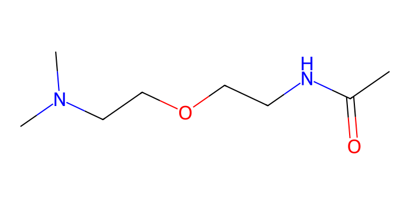

# FG Finder
 
[](https://doi.org/10.5281/zenodo.10966985)
[](https://pypi.org/project/FGFinder/)
[](https://pypi.org/project/FGFinder/)
[](https://opensource.org/licenses/MIT)
 
A Python package to identify functional groups in molecules, built on top of [RDKit](https://www.rdkit.org/).

## Table of contents
 
- [Installation](#installation)
- [Quick start](#quick-start)
- [Citation](#citation)
- [License](#license)

## Installation
 
### From PyPI
 
```bash
pip install FGFinder
```
 
### From source
 
```bash
git clone https://github.com/Borest5543/Fg_Finder
cd Fg_Finder
pip install .
```

**Requirements:** Python ≥ 3.8, RDKit, NumPy ≤ 1.26.4, Pandas ≤ 2.2.2.


 ## Quick start
 
```python
from FGFinder import FindFG
from rdkit import Chem
 
search = FindFG()
smiles = "CC(=O)NCCOCCN(C)C"

# Visualize the molecule
Chem.MolFromSmiles(smiles)
```


```python
# Identify functional groups
search.findFunctionalGroups(smiles)
```
| Functional Groups          |   Frequency | SMARTS                                                                                                                      |
|:---------------------------|------------:|:----------------------------------------------------------------------------------------------------------------------------|
| Primary_carbon             |           1 | `[CX4H3][#6]`                                                                                                               |
| Dialkylether               |           1 | `[OX2]([CX4;!$(C([OX2])[O,S,#7,#15,F,Cl,Br,I])])[CX4;!$(C([OX2])[O,S,#7,#15])]`                                             |
| Amine                      |           1 | `[NX3+0,NX4+;!$([N]~[!#6]);!$([N]*~[#7,#8,#15,#16])]`                                                                       |
| Tertiary_aliph_amine       |           1 | `[NX3H0+0,NX4H1+;!$([N][!C]);!$([N]*~[#7,#8,#15,#16])]`                                                                     |
| Carboxylic_acid_derivative |           1 | `[$([#6X3H0][#6]),$([#6X3H])](=[!#6])[!#6]`                                                                                 |
| Amide                      |           1 | `[CX3;$([R0][#6]),$([H1R0])](=[OX1])[#7X3;$([H2]),$([H1][#6;!$(C=[O,N,S])]),$([#7]([#6;!$(C=[O,N,S])])[#6;!$(C=[O,N,S])])]` |
| Secondary_amide            |           1 | `[CX3;$([R0][#6]),$([H1R0])](=[OX1])[#7X3H1][#6;!$(C=[O,N,S])]`                                                             |

```python
# Encode functional groups as a bitvector (ML-ready)
search.functionalGroupASbitvector(smiles)
```

```pycon
>>> search.functionalGroupASbitvector(smiles)
array([1, 0, 0, 0, 0, 0, 0, 0, 0, 0, 0, 0, 0, 0, 0, 1, ...,
       0, 0, 0, 0, 0, 0, 0, 0, 0, 0, 0, 0, 0], dtype=int64)
```

A full walkthrough is available in [`notebooks/Example.ipynb`](notebooks/Example.ipynb).

## Citation
 
If you use FG Finder in your research, please cite:
 
```bibtex
@software{fgfinder,
  author  = {Túlio Augusto and Jefferson Richard},
  title   = {FG Finder: a Python package to identify functional groups in molecules},
  year    = {2024},
  doi     = {10.5281/zenodo.10966985},
  url     = {https://github.com/Borest5543/Fg_Finder}
}
```
 
DOI: [10.5281/zenodo.10966985](https://doi.org/10.5281/zenodo.10966985)
 
## License
 
Released under the [MIT License](LICENSE).